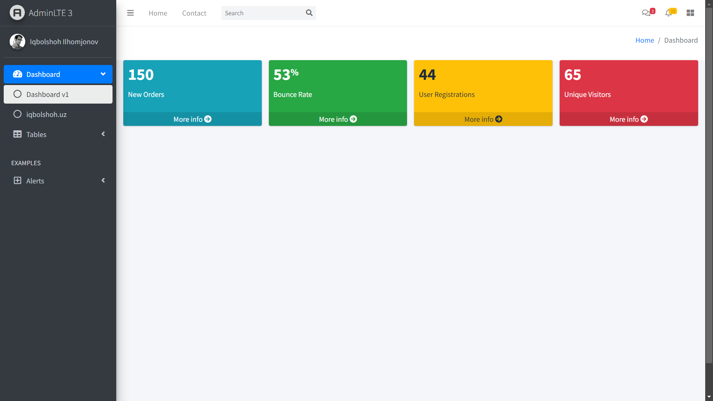

# PHP Admin Panel

This project is a PHP-based web application developed by Iqbolshoh Ilhomjonov. The application includes various features and functionalities such as user alerts, data tables, a dynamic navigation menu, and a customizable admin panel with a banner.



## Table of Contents

- [Project Structure](#project-structure)
- [Installation](#installation)
- [Usage](#usage)
- [Files Description](#files-description)
- [Technologies Used](#technologies-used)
- [Contributing](#contributing)
- [Contact](#contact)

## Project Structure

The project structure is as follows:

```
.
├── images
│   ├── AdminLTELogo.png
│   ├── user2-160x160.jpg
│   ├── banner.png
├── includes
│   ├── css.php
│   ├── footer.php
│   ├── js.php
│   ├── navbar.php
│   ├── js
│   │   ├── adminlte.js
│   │   ├── adminlte.min.js
│   │   ├── bootstrap.bundle.min.js
│   │   ├── dataTables.bootstrap4.min.js
│   │   ├── jquery.dataTables.min.js
│   │   ├── jquery.min.js
│   │   ├── sweetalert2.min.js
│   │   └── toastr.min.js
│   ├── css
│   │   ├── adminlte.min.css
│   │   ├── dataTables.bootstrap4.min.css
│   │   ├── sweetalert2-theme-bootstrap-4.css
│   │   └── toastr.min.css
├── alert.php
├── data.json
├── index.php
├── iqbolshoh.php
├── table.php
└── README.md
```

## Installation

To run this project locally, follow these steps:

1. Clone the repository:
   ```bash
   git clone https://github.com/iqbolshoh/php-admin-panel.git
   ```
2. Navigate to the project directory:
   ```bash
   cd php-admin-panel
   ```
3. Make sure you have a local server setup (e.g., XAMPP, WAMP, MAMP) and place the project files in the server's root directory.

## Usage

To use the application, open your browser and navigate to `http://localhost/php-admin-panel`. This will load the main page of the application.

## Technologies Used

-  **HTML5**
-  **CSS3**
-  **JavaScript**
-  **jQuery**
-  **PHP**
-  **Bootstrap**
-  **DataTables**

## Contributing

Contributions are welcome! If you have suggestions or want to enhance the project, feel free to fork the repository and submit a pull request.

## Connect with Me

I love connecting with new people and exploring new opportunities. Feel free to reach out to me through any of the
platforms below:

<table>
    <tr>
        <td>
            <a href="https://t.me/iqbolshoh_777">
                
            </a>
        </td>
        <td>
            <a href="https://instagram.com/iqbolshoh_777" target="blank"></a>
        </td>
        <td>
            <a href="https://wa.me/qr/22PVFQSMQQX4F1">
                
            </a>
        </td>
        <td>
            <a href="https://x.com/iqbolshoh_777">
                
            </a>
        </td>
        <td>
            <a href="https://www.linkedin.com/in/iqbolshoh/">
                
            </a>
        </td>
        <td>
            <a href="mailto:iilhomjonov777@gmail.com">
                
            </a>
        </td>
    </tr>
</table>
