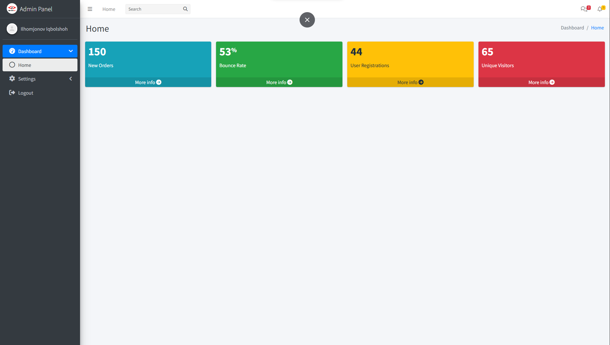

# 📊 PHP Admin Panel

This project is a **PHP-based web application** 🖥️ developed by **Iqbolshoh Ilhomjonov** 👨‍💻. The application includes various features such as **user alerts**, **data tables**, **a dynamic navigation menu**, and a **customizable admin panel with a banner** 🏆🎯.  

  

---

## ⚙️ Installation 🏗️  

To run this project locally, follow these steps:  

1️⃣ **Clone the repository** 📂:  
   ```bash
   git clone https://github.com/iqbolshoh/php-admin-panel.git
   ```  
2️⃣ **Navigate to the project directory** 📁:  
   ```bash
   cd php-admin-panel
   ```  
3️⃣ **Set up a local server** 🌍 (e.g., **XAMPP, WAMP, MAMP**) and place the project files in the server's root directory **(htdocs/www)**.  

---

## 🚀 Usage 🎯  

To use the application, open your **browser** 🌐 and navigate to:  

🔗 `http://localhost/php-admin-panel`  

This will load the **main page** of the application. 🎉  

---

## 📌 Adding Sidebar Menu Items 🏗️  

The **`$menuItems`** array defines the **sidebar menu** 📜. Each item includes:  

✅ **`menuTitle`** – The section name 🏷️ (e.g., `"Menu"`).  
✅ **`icon`** – The section icon 🎨 (e.g., `"fas fa-home"`).  
✅ **`pages`** – Subpages with `"title"` (name) and `"url"` (link) 🔗.  

### 📝 Example: Adding/Updating Menu Items  

```php
$menuItems = [
    [
        "menuTitle" => "Dashboard",
        "icon" => "fas fa-tachometer-alt",
        "pages" => [
            ["title" => "Home", "url" => "index.php"]
        ],
    ],
    [
        "menuTitle" => "Settings",
        "icon" => "fas fa-cog",
        "pages" => [
            ["title" => "Profile", "url" => "profile.php"]
        ],
    ]
];
```


## 🖥 Technologies Used


## 📜 License
This project is open-source and available under the **MIT License**.

## 🤝 Contributing  
🎯 Contributions are welcome! If you have suggestions or want to enhance the project, feel free to fork the repository and submit a pull request.

## 📬 Connect with Me  
💬 I love meeting new people and discussing tech, business, and creative ideas. Let’s connect! You can reach me on these platforms:

<div align="center">
  <table>
    <tr>
      <td>
        <a href="https://iqbolshoh.uz" target="_blank">
          
        </a>
      </td>
      <td>
        <a href="mailto:iilhomjonov777@gmail.com" target="_blank">
          
        </a>
      </td>
      <td>
        <a href="https://github.com/iqbolshoh" target="_blank">
          
        </a>
      </td>
      <td>
        <a href="https://www.linkedin.com/in/iqbolshoh/" target="_blank">
          
        </a>
      </td>
      <td>
        <a href="https://t.me/iqbolshoh_777" target="_blank">
          
        </a>
      </td>
      <td>
        <a href="https://wa.me/998997799333" target="_blank">
          
        </a>
      </td>
      <td>
        <a href="https://instagram.com/iqbolshoh_777" target="_blank">
          
        </a>
      </td>
      <td>
        <a href="https://x.com/iqbolshoh_777" target="_blank">
          
        </a>
      </td>
      <td>
        <a href="https://www.youtube.com/@Iqbolshoh_777" target="_blank">
          
        </a>
      </td>
    </tr>
  </table>
</div>
